# Acceptance Tests
---
## Exception Declaration
Note: Points and places of emails may vary depending on if you engage with posts in Piazza outside of the instructions provided, or if another user is interacting with the forum at the same time. If you complete the use cases out of the order we have provided (1 -> 4 -> 3 (Subscribe to receive incentive message) -> 2 -> 3 (Unsubscribe to receive incentive message)), you may also see differences in points.

Points are calculated based on parameters for each type of participation activity in Piazza. They are all set to 1 by default. We classify activity into 4 categories: Questions, Answers/Followups, Views, and Endorsements. Questions include notes. Answers/followups include student answers and follow up comments. For endorsements, liking your own posted content (questions, answers, followups) does not count. Private or anonymous posts are not counted in activity. Ideally, performance summary and private bot messages should only be sent once a day, but to show our use case works, they are sent every 10 seconds.

The below code snippet is the Cron time scheduler (located in [events/ready.js](events/ready.js)) to schedule the performance summary and private bot messages sent every 10 seconds. To schedule this task to send daily, we can simply change `'*/10 * * * * *'` in the second line to something like `'0 0 0 * * *'`. This way, a message will be sent at 12 A.M. EST everyday.

```{js}
let scheduledMessage = new cron.CronJob(
   '*/10 * * * * *',
   async () => {
       studentFunc.dailyTop(mongoose).then(res => {
           channel.send(res);
           console.log("Daily top sent");
       })
   },
   null,
   true,
   'America/New_York'
);
```
---
## Prerequisite

1. Join our test Piazza course (https://piazza.com/class/l0k527orea42id). see email invitation sent on April, 17th, course name is also CSC 510). Please contact us if you cannot find the Piazza invitation.
2. Download Discord (https://discord.com/download) and join our Discord server (https://discord.gg/ndujxUH7Yu).

---
## Use Case 1 - Customize daily performance summary sent in the group-sharing Discord channel

### 1. UAT SCOPE

    1.1: Instructor can perform login and associate relationship between 
    Discord server and registered Piazza course.
    1.2: Daily performance summary are sent by BOT in group-sharing 
    Discord channel.
    1.3: Instructor can customize performance score parameter with slash command

### 2. UAT TEST PROCEDURE
### 2.1 Instructor Login

STEP 1: In the #general channel, type "/". From the list of Discord commands, select the `/login` command with the description "Log in with piazza email and password for instructor". 

EXPECTED RESULT: See the list of Discord commands below for reference.

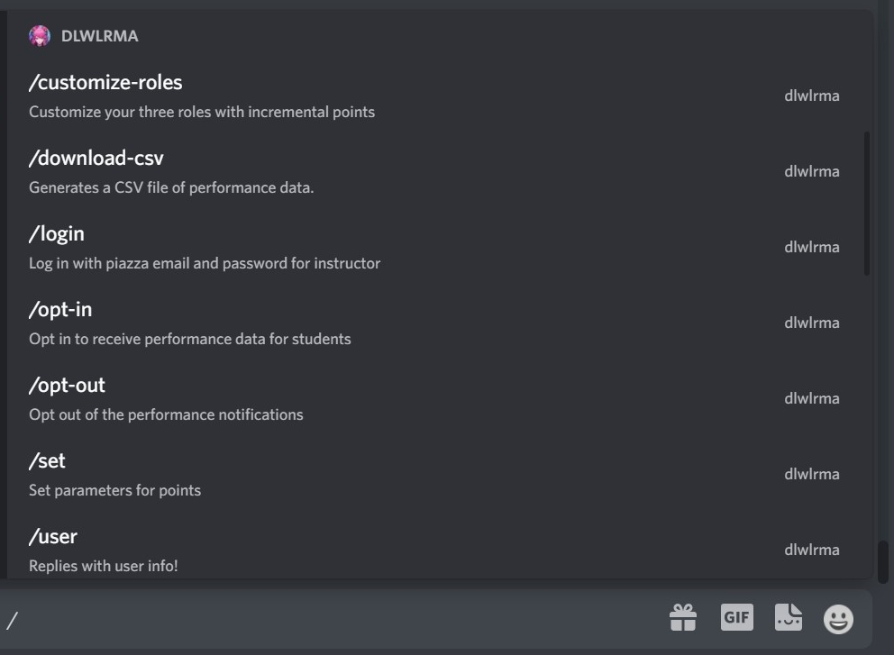

STEP 2: There are three parameters: "email", "password", and "network-id". Enter all three values in the promoted slash command and hit enter to send. (These values are provided via the Google form.) 

EXPECTED RESULT: The bot replies with a private message in the channel: "Login success".

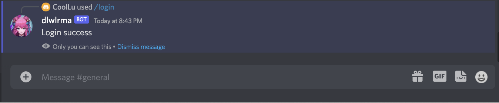

**PASS/FAIL: PASS**

**RESULT COMMENT: Association is verified. Further verification can be derived from 2.2 and 2.3.** 

### 2.2 Daily Performance Summary Sent in Group-Sharing Channel
STEP 1: Click on the #cron channel and verify daily summary messages.

EXPECTED RESULT: 

"Top 3 Daily Points
1. *some email* - 0
2. *some email* - 0
3. *some email* - 0"

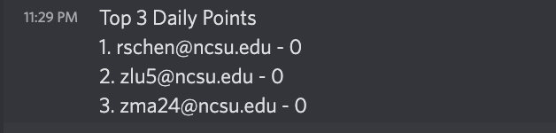

STEP 2: Go to Piazza (https://piazza.com/class/l0k527orea42id) and post a public question with your name shown. Post an answer and follow-up to your question, then like the question. Now check the #cron channel in Discord and wait up to a minute. 

EXPECTED RESULT:

"Top 3 Daily Points
1. *your email* - *positive number*
2. *some email* - 0
3. *some email* - 0"

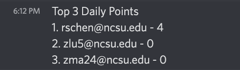

The number of points next to your email should be at least 3 (1 question * 1 point and 2 answers/followups * 1 point = 3 points), but may be more depending on the number of views on your post and if there is interaction with/from other Piazza users. You may need to refresh the post to see the views. It is also helpful to point out that performance score parameters are set to "Questions" = 1,"Answers" = 1,"Views" = 1,"Endorsements" = 1. More details on performance score parameters will be discussed in the next section.

**PASS/FAIL: PASS**

**RESULT COMMENT: By comparison between two #cron messages above, successful daily summary update and message delivery can be verified.**


### 2.3 Set performance score parameters
STEP 1: In the #general channel, type "/". From the list of Discord commands, select the `/set` command with the description "Set parameters for points". There are four parameters: "p1", "p2", "p3", and "p4". Enter "2", "3", "1", and "4" as the respective parameter values, then send the message. 

EXPECTED RESULT: Check that the bot returns the following message in the channel:

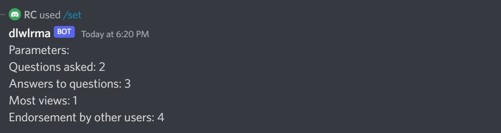

STEP 2: Go to Piazza (https://piazza.com/class/l0k527orea42id) and post a public question with your name shown. Post an answer and follow-up to your question, then like the question. Now check the #cron channel in Discord and wait up to a minute. You should see a few messages like this:

EXPECTED RESULT:

"Top 3 Daily Points
1. *your email* - *positive number*
2. *some email* - 0
3. *some email* - 0"

The number of points next to your email should be at least 8 points (1 question * 2 points and 2 answers/followups * 3 points = 8 points), but may be more depending on the number of views on your post and if there is interaction with/from other Piazza users. You may need to refresh the post to see the views.

**PASS/FAIL: PASS**

**RESULT COMMENT: By comparison between two #cron messages above, expected points associated with the user are correctly calculated based on performance score matrix.**

### 3. EDGE CASE IDENTIFICATION

3.1: In the #general channel, type "/". From the list of Discord commands, select the `/login` command. Enter your "email", "password" and "network-id" as the respective parameter values, then send the message. Check that the bot returns the following message in the channel: "Login failed" to identify no valid instructor credential entered.

3.2: In the #general channel, try sending the `/set` command with the parameter values "11", "0", "10.5", and "-1". Check that Discord does not allow you to send the command. Try again without entering anything for the parameters and check that you cannot send the command.

3.3: Wait until the #cron channel is sending messages with 0 points for all places again, then go to Piazza and post a private question. Wait up to a minute and check the #cron channel. You should still only see messages with 0 points for all places. Private posts in Piazza are not counted toward points. Repeat this with a public post with your name hidden. You should also only see messages with 0 points for all places, because anonymous activity is not counted toward points.

### 4. USE CASE 1 - UAT RESULT
- [X] PASS

## Use Case 4 - Fetching performance summary CSV file as academic record
### 1. UAT SCOPE

    1.1:  User can fetch overall performance summary for the whole class in CSV file format

### 2. UAT TEST PROCEDURE
### 2.1 Download Performance Summary CSV File

STEP 1: In the #general channel in the Discord server, send the command `/download-csv`.

EXPECTED RESULT: 

The bot returns a message in the channel "CSV file generated." with a CSV file called `piazza.csv`. Check that the first row of the CSV files is: `"Email","Questions","Answers","Views","Endorsements","_id","__v"`. The other rows contain data on students in the Piazza course. Check that the number of questions, answers, views, and endorsements multiplied by the parameters from the `/set` command is equal to the number of points for each student:

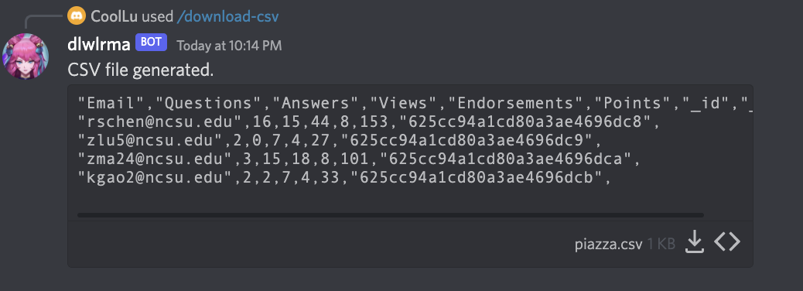

Points = Questions * p1 + Answers * p2 + Views * p3 + Endorsements * p4

Note: Whenever you set the point parameters with the `/set` command, you will need to wait a little for the total points to be synchronized when you use the `/download-csv` command. This won't become an issue if the Cron schedule to set to daily delivery as described in `Exception Declaration` above. 

**PASS/FAIL: PASS**

**RESULT COMMENT: Overall performance summary file is correctly generated and available for user download.**

### 3. EDGE CASE IDENTIFICATION
N/A.

### 4. USE CASE 4 - UAT RESULT
- [X] PASS

---
## Use Case 3: Subscribe to receive incentive message (up-to-date points earned message) in the private Discord channel

### 1. UAT SCOPE

    1.1: User can subcribe to receive incentive message in the private Discord channel
    1.2: User can unsubribe to incentive message

### 2. UAT TEST PROCEDURE
### 2.1 Subscribe to Receive Incentive Message

STEP 1: Verify that the bot is not sending you private messages at the moment to begin with. (Note: You can always select `/opt-out` command to unsubscribe.)

STEP 2: In the #general channel, type "/". From the list of Discord commands, select the `/opt-in` command with the description "Opt-in to receive performance data for students". In the text field next to the "email" parameter, enter the email address associated with your Piazza account, then send the message.

EXPECTED RESULT:

1. The bot returns the following message in the channel: "Your Piazza email: *email entered*". 

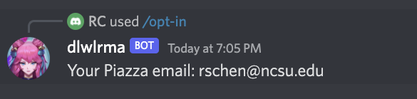

2. Check for private messages from the bot. You should see some messages like this: "The point you earned today is : 0. Please keep it up!"

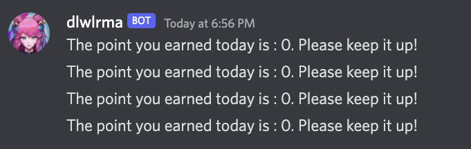

STEP 3: Go to our Piazza course (https://piazza.com/class/l0k527orea42id) and post a public question with your name shown. Post an answer and a follow up to the question. 

EXPECTED RESULT: 

1. The bot sends you a few messages like this: "The point you earned today is : 8. Please keep it up!"

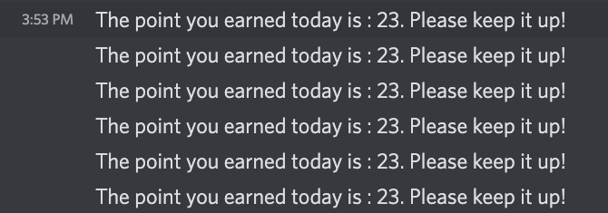

2. Verify the #cron channel in Discord. You should see a few "Top 3 Daily Points..." messages with your email and positive number of points. Check that the number of points in the message matches the number of points in your private message from the bot.

3. After a minute or so, the points in the private messages and "Top 3 Daily Points..." messages should revert back to 0 because one day systematically passed with our Cron scheduler.

**PASS/FAIL: PASS**

**RESULT COMMENT: Up-to-date points for associated student is correctly generated and sent in the BOT private message.**

### 2.2 Unsubscribe to Incentive Message

STEP 1: In the #general channel, type "/". From the list of Discord commands, select the `/opt-out` command with the description "Opt out of the performance notifications" and send the message.

EXPECTED RESULT:

1. The bot returns the following message in the channel: "You have opted out of the performance notifications." 

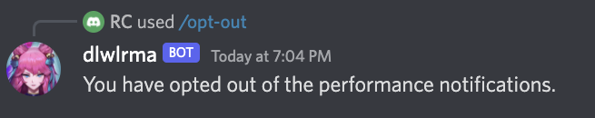

2. Check that the bot no longer sends you private messages.

**PASS/FAIL: PASS**

**RESULT COMMENT: BOT does not send private messages after un-subscription.**

### 3. EDGE CASE IDENTIFICATION
In the #general channel, send the `/opt-in` command again with "abc" next to the "email" parameter to represent at invalid email. Check that the bot returns the following message in the channel: "Your Piazza email: abc". Check that the bot is not sending you private messages. Try this again without entering anything for an email and with a valid email not associated with your Piazza account. Check that the bot returns a message in the channel: "Your Piazza email: *your input*" but does not send you private messages.

### 4. USE CASE 3 - UAT RESULT
- [X] PASS

---
## Use Case 2 - Customize ranking hierarchy to students based on overall performance

## Prerequisite for Use Case 2 Only
You must opt in to direct messages from the bot (See Use Case 3) in order to set your role. Otherwise, your role will not update/presented.

### 1. UAT SCOPE

    1.1: Instructor can customize ranking hierarchy and users are assigned roles based on customization

### 2. UAT TEST PROCEDURE
### 2.1 Customize Ranking Hierarchy

STEP 1: Check that in the list of Discord server users on the right, there are no roles assigned. All users should either be labeled "Online" or "Offline".

STEP 2: In the #general channel in the Discord server, type "/". From the list of Discord commands, select the `/customize-roles` command with the description "Customize your three roles with incremental points". There are four parameters: "l1", "l2", "l3", and "incremental". Enter "Level 1", "Level 2", "Level 3", and "1000" as the respective parameter values, then send the message. 

EXPECTED RESULT: 

1. Check that the bot returns the following message in the channel:

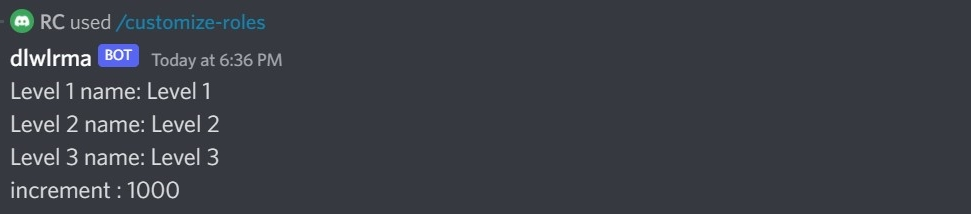

(Important Note: Please ensure you enter parameters as exactly the above "Level 1". Please be aware of the space between "Level" and "1". Otherwise, our system will just remove all the associated roles of the users)

2. Wait for a minute and check that you are not assigned any role. (The increment "1000" defines the number of points you must earn to reach a new level. For example, after enter the above slash command, "Level 1" is now set to 1000 - 1999 points, "Level 2" is set to 2000-2999 points, and "Level 3" is set to 3000+. Obviously, no user has been reached to 1000 and more, so there is no roles assigned to any users.)

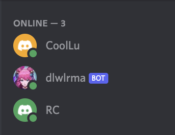

STEP 3: In the #general channel in the Discord server, type "/". From the list of Discord commands, select the `/customize-roles` command with the description "Customize your three roles with incremental points". Enter "Level 1", "Level 2", "Level 3". For the "incremental" parameter, enter the number of points you have (see `piazza.csv` from the `/download-csv` command).

EXPECTED RESULT: 

1. The bot returns a message like the above, except with a different number of points next to "increment :".

2. Check that the list of server users is updated so that you are assigned the "Level 1" role, which is the lowest role in the hierarchy. This may take a minute or so. (Note: If you have not posted anything on Piazza (i.e. enter 0 for the "incremental" parameter), you will not have an assigned level.)

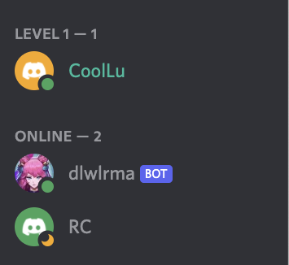

STEP 4: In the #general channel in the Discord server, type "/". From the list of Discord commands, select the `/customize-roles` command with the description "Customize your three roles with incremental points". Enter "Level 1", "Level 2", "Level 3", and "1" as the respective parameter values, then send the message.

EXPECTED RESULT: 

1. Check that the bot returns the following message in the channel:

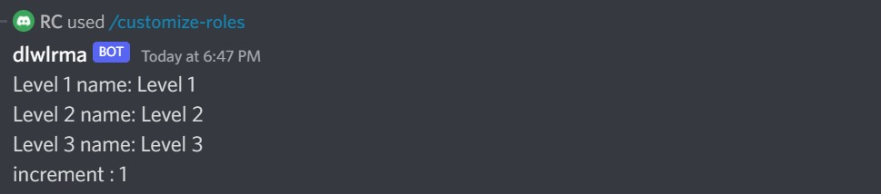

2. Check that the list of server users is updated so that you are assigned the "Level 3" role. This may take a minute or so. (This is dependent on whether you have already posted something on Piazza. Otherwise, you may have no points.)

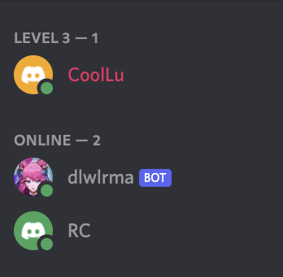

**PASS/FAIL: PASS**

**RESULT COMMENT: Instructor can customize ranking hierarchy and users are assigned roles correctly base on customization.**

### 3. EDGE CASE IDENTIFICATION
N/A.

### 4. USE CASE 2 - UAT RESULT
- [X] PASS
